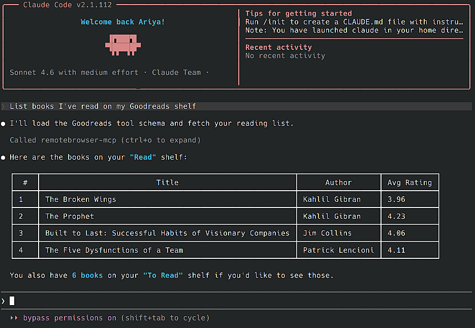

An MCP server for extracting personal data from many services: Amazon order history, Garmin activity stats, Zillow favorites, and more.

It works with [Claude Code](https://claude.ai/code), [LM Studio](https://lmstudio.ai), [Gemini CLI](https://google-gemini.github.io/gemini-cli), and many more.



### Quickstart

Run [Chrome Fleet](https://github.com/remotebrowser/chromefleet), note its service address (e.g. `http://192.168.1.2:8300`), set it as `CHROMEFLEET_URL`, then start this MCP server:

```bash
export CHROMEFLEET_URL=http://192.168.1.1:8300
docker run -p 23456:23456 -e CHROMEFLEET_URL ghcr.io/remotebrowser/mcp-getgather
```

Alternative ways to run it:

<details>
<summary>Docker Compose</summary>

```yaml
services:
  remotebrowser-mcp:
    image: ghcr.io/remotebrowser/mcp-getgather
    ports:
      - "23456:23456"
    environment:
      - CHROMEFLEET_URL
    restart: unless-stopped
```

</details>

<details>
<summary>Inline podman</summary>

```bash
export CHROMEFLEET_URL=http://192.168.1.1:8300
podman run -p 23456:23456 -e CHROMEFLEET_URL ghcr.io/remotebrowser/mcp-getgather
```

</details>

<details>
<summary>Run with Python</summary>

You'll need [uv](https://docs.astral.sh/uv) with [Python](https://python.org) >= 3.11. After cloning this repo:

```bash
uv run -m uvicorn getgather.main:app --port 23456
```

</details>

### Connect to MCP clients

**Standard config** works with most tools:

```js
{
  "mcpServers": {
    "remotebrowser-mcp": {
      "url": "http://127.0.0.1:23456/mcp"
    }
  }
}
```

<details>
<summary>Claude Code</summary>

Use the Claude Code CLI to add the MCP server:

```bash
claude mcp add --transport http remotebrowser-mcp http://localhost:23456/mcp
```

</details>

<details>
<summary>Claude Desktop</summary>

Follow the MCP install [guide](https://modelcontextprotocol.io/quickstart/user), use the standard config above.

</details>

<details>
<summary>Gemini CLI</summary>

Follow the MCP install [guide](https://github.com/google-gemini/gemini-cli/blob/main/docs/tools/mcp-server.md#configure-the-mcp-server-in-settingsjson), use the standard config above.

</details>

<details>
<summary>LM Studio</summary>

Go to `Program` in the right sidebar -> `Install` -> `Edit mcp.json`. Use the standard config above.

</details>

<details>
<summary>VS Code</summary>

Follow the MCP install [guide](https://code.visualstudio.com/docs/copilot/chat/mcp-servers#_add-an-mcp-server), use the standard config above.

</details>
